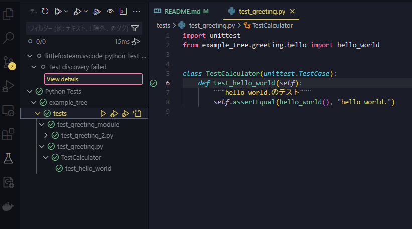

# python ディレクトリ構成サンプル

## 概要

以前からpythonのモジュールimportエラーに悩まされていた。

メインのモジュールとテスト用ディレクトリをプロジェクトに配置して、動くことを確認したのでここに残す。

## 環境

- OS: Ubuntu-20.04
- Python 3.8.10
- VScode 1.95.3

## 実行方法

メインモジュールの実行

```python
python -m example_tree
```

テストの実行（unittest）

```python
python -m unittest discover -s tests -p "*.py"
```

VScodeでのテスト実行では、

- unittest →テストが読み込めない
- pytest →テスト成功

という結果になった。


